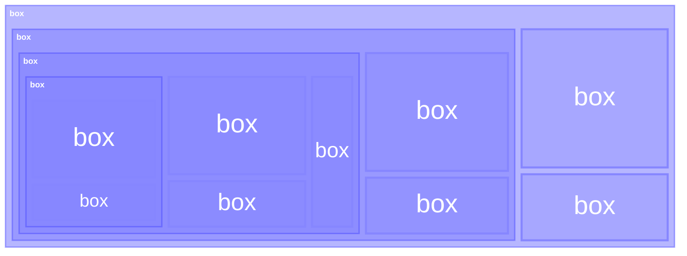

<h1 align="center">📦 Recursive Boxes</h1>




<h2 align="center">An architectural strategy for building large complex systems from simple, testable blocks.</h2>

## TL;DR

* **`Boxes are boundaries around responsibilities.`**
* **`Boxes expose contracts, hide implementations.`**
* **`Boxes can be grouped, stacked, and nested recursively.`**

Recursive Boxes is a strategy for designing **modular monoliths** for large, complex systems by defining **testable interfaces all the way down**.

When you treat components, subsystems, and even whole applications as **recursive boxes** with clear boundaries, your systems become scalable, evolvable, and easier to reason about.


> [!TIP]
> Recursive Boxes focuses on **system-level architecture** — grouping, stacking, and nesting subsystems and modules with clean, testable boundaries.
>
> This is built on **`Testable-Interface Driven Development (TIDD)`**, a design practice for independent modules. See the `TIDD` companion project [here](https://github.com/kartikg33/tidd).


## What is Recursive Boxes?

Most teams default to one of two architectural strategies:

* **Layering (horizontal slices)**: e.g. Apps → Middleware → Platform.
* **Profiling (vertical domains)**: e.g. “WLAN”, “LAN”, “WAN”, "Firewall".

**Recursive Boxes unifies both.**

* You can **stack boxes** on top of one another as functional layers.
* You can **nest boxes** inside other boxes for domain encapsulation.
* You can **group boxes** together for interoperability, such as with microservices.

The result: a **flexible, recursive hierarchy** where each box is a self-contained unit with:

* **A single responsibility**
* **A testable interface (the contract)**
* **Hidden internals (implementation details obfuscated from the outside)**

This makes Recursive Boxes especially effective for building **modular monoliths** — scalable systems that start simple but can grow without collapsing under complexity.


## Core Principles

1. **Single Responsibility Principle (SRP)**

   * Each box has **one clear purpose**.
   * If a box is doing too much, split it into smaller boxes.
   * Mirrors *bounded contexts* in Domain-Driven Design (DDD).

2. **Separation of Concerns (SoC)**

   * Boxes don’t know each other’s internals.
   * Interactions happen only through **well-defined contracts**.
   * Extends *Interface-Driven Design (IDD)* beyond modules to subsystems.

3. **Encapsulation and Abstraction**

   * A box hides its internals and exposes only what’s necessary.
   * Smaller boxes can be **nested** inside larger ones for abstraction.
   * This allows subsystems to act as **black boxes** to the outside world.

4. **Testability as Proof of Good Design**

   * If you can’t write meaningful tests for a box, its boundaries are wrong.
   * Tests validate **contracts, not implementation details**.
   * Evolves *Test-Driven Development (TDD)* to focus on testing at the interface level. (See the companion project [TIDD - Testable-Interface Driven Development](https://github.com/kartikg33/tidd)

5. **Composable Hierarchies (Recursive Design)**

   * Small boxes → larger boxes → full systems.
   * The same rules apply at every level: versioned contract + hidden internals.

6. **Low Coupling, High Cohesion**

   * Interaction is minimal and contract-driven (low coupling), but guaranteed to work due to well-defined, versioned, and testable interfaces (high cohesion).
   * Aligns with Clean Architecture principles.

7. **Grouping, Stacking, and Nesting**

   * **Grouping** = organise related unit within a subsystem.
   * **Stacking** = layering of separate concerns.
   * **Nesting** = abstraction of domains and domain responsibilities.
   * **Recursive Boxes lets you combine all three.**

8. **Scalable Design Path**
   * **`Monolith` = one huge box.** Likely to incur tech debt and huge maintenance cost as complexity grows.
   * **`Modular Monolith` = breaking the huge box into smaller boxes.** Easier to maintain and add more complex features. Contracts keep the system stable even as implementations evolve.
   * **`Microservices` = scaled distribution of boxes.** 


## Relationship to Other Methods

Recursive Boxes is built on the principles of `TDD`, `IDD`, and `DDD`:

| Method | Focus | Limitation | How Recursive Boxes and [TIDD](https://github.com/kartikg33/tidd) Extends This |
| --- | --- | --- | --- |
| **Test Driven Development (TDD)** | Code correctness via tests | High maintenance cost if tied too tightly to implementation details | Tests target **contracts** instead of code internals |
| **Interface Driven Development (IDD)** | Well-defined Interfaces | Interfaces can be too abstract; not practically testable with real-world use cases | **Every interface must be testable**, even at the subsystem level |
| **Domain Driven Development (DDD)** | Domain separation (bounded contexts) | Leaves implementation structure flexible. Lacking interface constracts and testability principles | Recursive Boxes provides a **recursive building-block structure** for bounded contexts |

### Relationship to TIDD

> [!TIP]
> Read up on [TIDD](https://github.com/kartikg33/tidd) here.

**TIDD** provides module-level design: every **interface** must be testable.

**Recursive Boxes** provides system-level architecture: every **subsystem** is a box with a testable contract.

Together:
* TIDD → **better modules**
* Recursive Boxes → **better systems**

## Practical Workflow Example

1. **Draw a box around a responsibility**

   * Example: “Payment Processing” is its own box.

2. **Define the contract (interface)**

   ```ts
   interface PaymentProcessor {
     charge(userId: string, amount: number): PaymentResult
   }
   ```

3. **Nest smaller boxes inside**

   * Fraud Detection, Balance Checker, and Transaction Writer live *inside* Payment Processing.
   * The outside world never sees them — only the `PaymentProcessor` contract.

4. **Write tests against the box contract**

   * Tests target guarantees (`amount > 0`, structured result, error handling).
   * Internal changes (e.g. replacing Fraud Detection) don’t break the contract or tests.

## Contributing

Here’s how you can contribute:

* Add design examples in the [`examples/`](./examples/) directory.
* Build tooling for recursive box definition + validation.
* Share Recursive Boxes as a practical strategy for **scalable, testable architectures**.